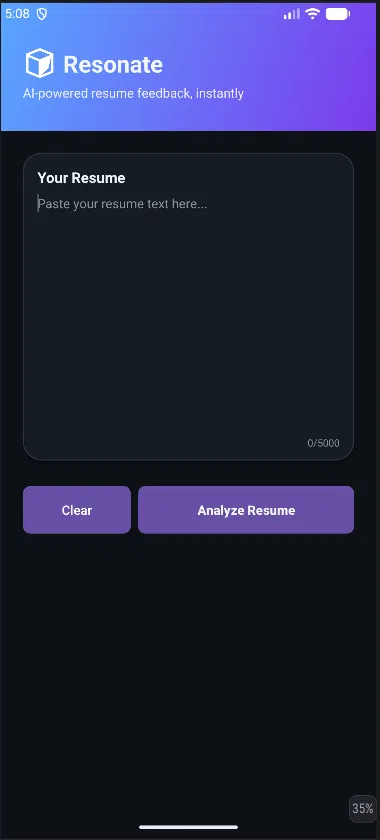
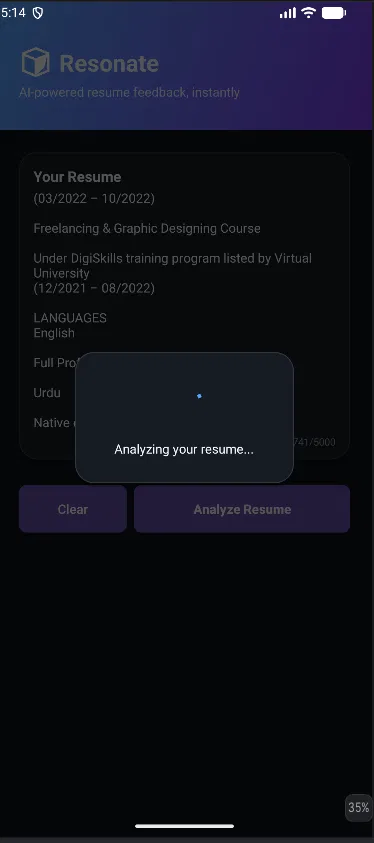
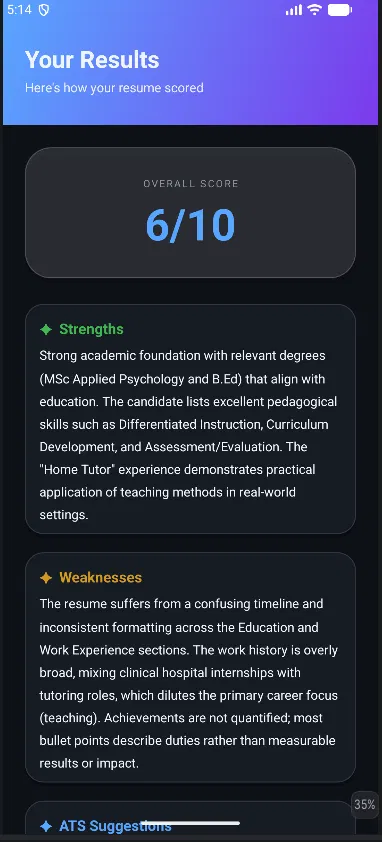

# Resonate — AI Resume Reviewer

An Android app that analyzes resumes using a locally-running LLM and provides 
instant, structured feedback with ATS optimization suggestions.

Built with Kotlin, OkHttp, and Coroutines. AI powered by Google Gemma 4 E4B 
running locally via LM Studio — no cloud API, no data leaving your machine.

---

## Screenshots

| Home Screen | Analyzing | Results |
|-------------|-----------|---------|
|  |  |  |

---

## Features

- Paste any resume text and get instant AI-powered analysis
- Overall score out of 10
- Specific strengths identified from your resume content
- Weaknesses with actionable detail
- ATS keyword optimization suggestions
- Copy results to clipboard
- Character counter (0/5000)
- Fully offline — runs on local LLM, no internet required

---

## Tech Stack

| Layer | Technology |
|-------|-----------|
| Language | Kotlin |
| UI | XML Views, View Binding, Material Design |
| Async | Kotlin Coroutines |
| Networking | OkHttp 4.12.0 |
| AI Model | Google Gemma 4 E4B (via LM Studio) |
| Min SDK | Android 8.0 (API 26) |

---

## Architecture

```
MainActivity          → User input, validation, loading state
ResumeAnalyzer        → OkHttp POST to local LLM server, JSON parsing
ResultsActivity       → Displays score, strengths, weaknesses, suggestions
```

The app sends resume text to a locally-running LM Studio server 
(OpenAI-compatible API) and parses the structured response using regex 
to extract each section independently.

---

## Running Locally

### Requirements
- Android Studio (latest)
- LM Studio with any OpenAI-compatible model loaded
- Android device or emulator (API 26+)

### Setup

1. Clone the repo
```bash
git clone https://github.com/yourusername/resonate.git
```

2. Open in Android Studio

3. Start LM Studio → Local Server → Start Server (default port 1234)

4. If using emulator, `BASE_URL` in `ResumeAnalyzer.kt` is already set to 
   `http://10.0.2.2:1234/v1/chat/completions`
   
   If using a physical device, change it to your PC's local IP:
   `http://192.168.x.x:1234/v1/chat/completions`

5. Run the app

---

## Design System

Custom dark theme inspired by Linear, GitHub Dark, and Vercel:

- **Background:** `#0D1117` / `#161B22` (layered depth)
- **Accent:** `#58A6FF` → `#7C3AED` (blue-purple gradient)
- **Typography:** Custom scale from 11sp (labels) to 48sp (score display)
- **Components:** Custom drawables for cards, buttons, and gradients

---

## Roadmap

- [ ] PDF upload support (PdfRenderer text extraction)
- [ ] Animated loading indicator
- [ ] Error state UI
- [ ] Play Store release
- [ ] Support for multiple AI models
- [ ] Resume history / saved analyses

---

## Developer

Built by Roshaan Haider — Pakistani developer focused on AI integration 
and Android development.

Open to freelance AI integration work and remote opportunities.
